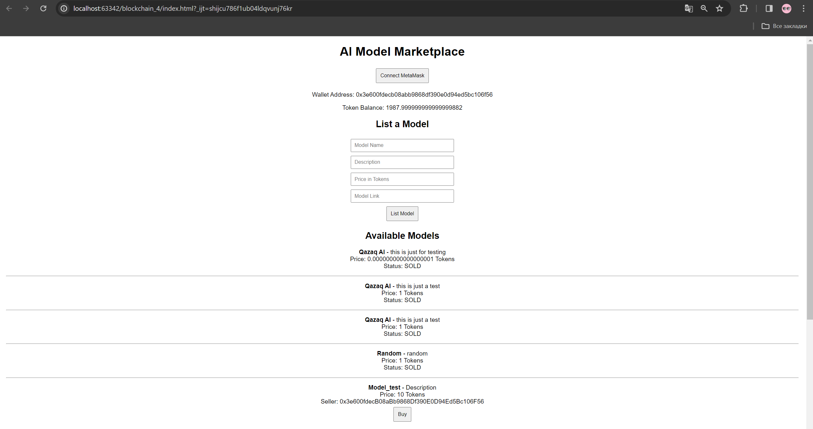
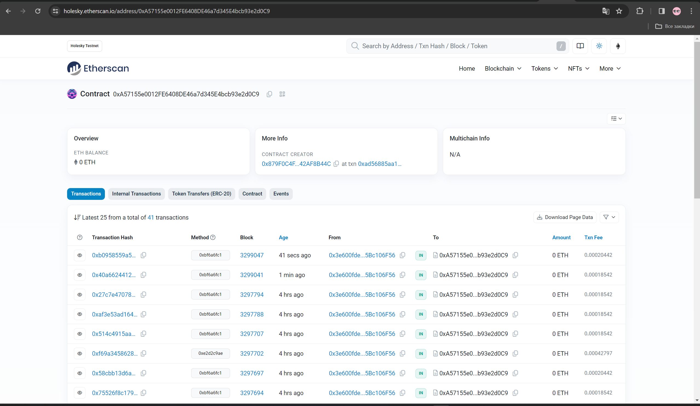

# AI Model Marketplace

## Overview
This project is an AI Model Marketplace where users can buy and sell AI models using an ERC-20 token. It integrates blockchain technology to ensure secure transactions and ownership validation.

## Features
- **User Authentication and Wallet Integration**: Users can connect their wallets using MetaMask.
- **Token Balance Display**: Displays the user's ERC-20 token balance and allows balance refreshing.
- **AI Model Listings**: Users can list AI models with details like name, description, price, and a model link.
- **Purchase Flow**: Users can buy AI models by transferring the required ERC-20 tokens to the seller.
- **Transaction History**: Users can view their past purchases and sales.
- **Secure Smart Contract Integration**: Ensures safe and verifiable transactions on the Ethereum blockchain.

## Usage
1. **Connect Wallet**: Click the "Connect MetaMask" button to authenticate.
2. **Check Token Balance**: The balance is displayed on the interface.
3. **List a Model**:
   - Enter model name, description, price in tokens, and model link.
   - Click "List Model" to register the model for sale.
4. **Buy a Model**:
   - Browse the available models.
   - Click the "Buy" button next to the model.
   - Confirm the transaction in MetaMask.
   - If successful, the model is marked as "SOLD".
5. **View Transaction History**:
   - Access the transaction history tab to see past purchases and sales.

## Installation
1. Clone the repository:
   ```
   git clone https://github.com/aselyagrammy/BC_asik4.git
   ```
2. Navigate to the project directory:
   ```
   cd ai-model-marketplace
   ```
3. Install dependencies:
   ```
   npm install
   ```
4. Run the development server:
   ```
   npm start
   ```
5. Open `index.html` in a browser with MetaMask installed.

## Smart Contract
The project uses an ERC-20 smart contract deployed at:
```
Contract Address: 0xA57155e0012FE6408DE46a7d345E4bcb93e2d0C9
```

## Screenshots
### Screenshot 1


### Screenshot 2


## License
This project is licensed under the [MIT License](LICENSE).

## References
- [Web3.js Documentation](https://docs.web3js.org/guides/dapps/metamask-vanilla/)
- [OpenZeppelin Smart Contracts](https://wizard.openzeppelin.com/)

